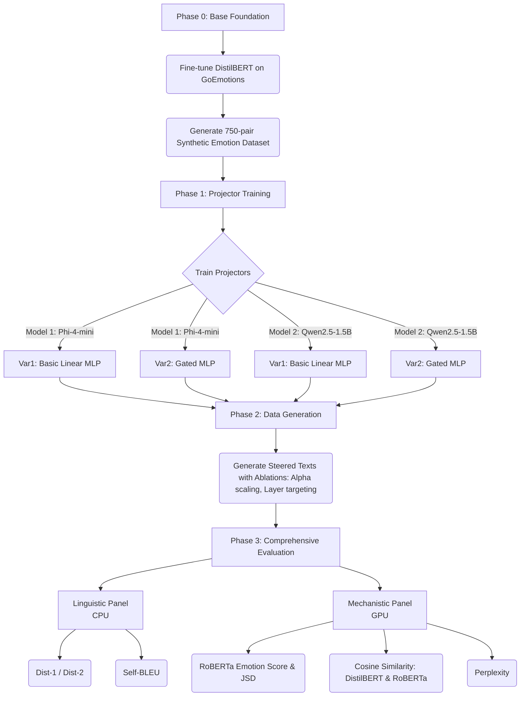

# 🎭 Emotional KV-Cache Injection for Frozen Transformers

> **Steering LLM outputs with emotion — without retraining a single parameter of the language model.**

This project implements **inference-time emotional control** of Large Language Models by injecting learned Key-Value (KV) prefixes into the transformer's attention cache. The emotion signal is extracted from text, projected into the KV-cache format, and prepended — causing the frozen LLM to generate text with the desired emotional tone.

---

## 📖 Table of Contents

- [🌟 Project Overview & Complete Pipeline](#-project-overview--complete-pipeline)
1. [What is an LLM?](#1-what-is-an-llm)
2. [What is the KV-Cache?](#2-what-is-the-kv-cache)
3. [Why is Emotion Steering Hard?](#3-why-is-emotion-steering-hard)
4. [Our Solution: KV-Cache Injection](#4-our-solution-kv-cache-injection)
5. [Variant 1: Basic Linear Projection](#5-variant-1-basic-linear-projection)
6. [Variant 2: Head-Wise Gated Modulation](#6-variant-2-head-wise-gated-modulation)
7. [Alpha Scaling & Layer-Wise Ablation](#7-alpha-scaling--layer-wise-ablation)
8. [Evaluation Methodology](#8-evaluation-methodology)
9. [Quick Start](#9-quick-start)
10. [Project Structure](#10-project-structure)
11. [Hardware Requirements](#11-hardware-requirements)
12. [Citation](#12-citation)

---

## 🌟 Project Overview & Complete Pipeline

Below is the complete end-to-end lifecycle of this research project, taking us from raw emotion classification all the way to the mechanistic evaluation of two state-of-the-art language models.



### 📊 Understanding Our Evaluation Metrics

To prove the efficacy of the KV-cache injection method for a Q1 journal submission, we utilize two distinct panels of metrics. 

#### 🗣️ Linguistic Metrics (Ensuring Conversational Quality)
These metrics ensure the model doesn't just repeat the same angry or happy words indefinitely, but maintains lexical richness.
- **Dist-1 & Dist-2 (Distinct N-Grams):** Measures how many unique single words or pairs of words the model uses. **High score** = rich, diverse vocabulary. **Low score** = repetitive drone.
- **Self-BLEU:** Measures how similar generated sentences are to *each other*. If the model says "I am so happy!" for every prompt when injected with Joy, Self-BLEU will be close to 1.0 (bad). We want **low Self-BLEU** for high conversational diversity.

#### ⚙️ Mechanistic & Emotional Metrics (Proving The Injection Works)
These metrics prove if the emotion was *actually* injected successfully, and if the language model survived the "brain surgery".
- **Target Emotion Score (via Independent RoBERTa):** We pass the manipulated output text into an *independent* RoBERTa model (that was never used in training). If it detects the target emotion with high probability, it proves the steering undeniably worked.
- **JSD (Jensen-Shannon Divergence):** Measures the absolute distributional shift. By comparing the 28-dimensional emotion probability of the "Vanilla" output versus the "Steered" output, JSD proves that the overall emotional tone of the sentence fundamentally changed (JSD > 0).
- **Cosine Similarity (Self-Consistency vs Independent Judge):** We take the 28-dimensional vector of the *raw input emotion text* (e.g. "I am furious") and the 28-dimensional vector of the *steered output text*. Calculating the cosine similarity between them using our train-judge (DistilBERT) shows self-consistency. Taking it from an external judge (RoBERTa) proves generalized, unbiased emotional alignment.
- **Perplexity (PPL):** Measures textual fluency. We pass the steered text back into the base LLM. If PPL stays close to the Vanilla text's PPL, it means our KV-injection didn't break the grammar or coherence of the LLM. If PPL skyrockets, we've lobotomized the model.

---

## 1. What is an LLM?

### 🧠 The Analogy

Imagine you have a friend who has read *every book ever written*. You start a sentence — "The cat sat on the..." — and they instantly predict the next word: **"mat"**. They don't *understand* cats or mats; they've simply seen this pattern millions of times and learned that "mat" is the most likely continuation.

A **Large Language Model (LLM)** works exactly like this friend. It's a massive neural network that has been trained on billions of sentences to predict the next word, given all the previous words. By chaining these predictions together — one word at a time — it can generate entire paragraphs, essays, or conversations.

### 📐 The Math: Transformer Attention

At the heart of every modern LLM is the **Transformer** architecture. Its core mechanism is **Scaled Dot-Product Attention**:

$$
\text{Attention}(Q, K, V) = \text{softmax}\!\left(\frac{Q K^\top}{\sqrt{d_k}}\right) V
$$

Where:
- $Q$ (Query) = "What am I looking for?"
- $K$ (Key) = "What information do I have?"
- $V$ (Value) = "What is the actual content of that information?"
- $d_k$ = dimension of each key vector (for numerical stability)

**In plain English:** Each word asks a question ($Q$), checks it against the labels on all available information ($K$), and retrieves the most relevant content ($V$). The softmax ensures the model pays *more attention* to the most relevant words and *less* to irrelevant ones.

---

## 2. What is the KV-Cache?

### 📝 The Analogy

Imagine you're taking an exam. You read question 1 and write your answer. When you get to question 2, you don't re-read the entire exam paper from scratch — your brain *remembers* what it already processed. 

The **KV-Cache** is the LLM's version of this memory. As the model generates each word, it computes the Key and Value vectors for that word and *stores them* in a cache. When generating the next word, it reuses all previously computed K and V vectors instead of recomputing them from scratch.

Without the KV-Cache, generating a 100-word response would require the model to reprocess all previous words at each step (quadratic cost). With it, each new word only needs to be compared against the cached keys — a massive speedup.

### 📐 The Math: KV-Cache Accumulation

At generation step $t$, the model computes:

$$
K_t = [K_1, K_2, \ldots, K_t], \quad V_t = [V_1, V_2, \ldots, V_t]
$$

The attention for the new token $q_t$ becomes:

$$
\text{Attention}(q_t, K_t, V_t) = \text{softmax}\!\left(\frac{q_t \, K_t^\top}{\sqrt{d_k}}\right) V_t
$$

Only $q_t$ is computed fresh — $K_t$ and $V_t$ are retrieved from the cache with the single new entry appended.

---

## 3. Why is Emotion Steering Hard?

### 🎯 The Problem

You want the LLM to respond with a *specific emotion* — say, joy, sadness, or anger. But the LLM was trained to predict the *most likely* next word across all of its training data, which averages over every emotional tone. It doesn't have an "emotion dial" you can turn.

Common approaches to steering have significant drawbacks:

| Approach | Drawback |
|----------|----------|
| **Fine-tuning** | Requires retraining billions of parameters, expensive GPU time, and risks catastrophic forgetting |
| **Prompt engineering** | Fragile, inconsistent, and the model may ignore emotional instructions |
| **LoRA / Adapters** | Still trains parameters; each emotion may need a separate adapter |

### 💡 The Key Insight

What if we could **whisper a mood into the model's memory** *before* it starts talking? Not by changing its brain (weights), but by slipping a carefully crafted "emotional sticky note" into its short-term memory (KV-cache)?

This is exactly what our method does.

---

## 4. Our Solution: KV-Cache Injection

### 🎭 The Analogy

Imagine an actor about to perform a scene. Before they start speaking their lines, their director whispers: *"Remember, you just lost someone you love."* The actor's words don't change (same script), but the *delivery* — the tone, emphasis, and emotional colour — shifts dramatically.

Our method works the same way:

1. **Extract the emotion** from a piece of text (e.g., "I'm so happy!") using a small emotion classifier
2. **Project that emotion** into the same format as the KV-cache (Key-Value pairs)
3. **Prepend** these emotional KV entries to the cache *before* the LLM generates any text
4. The LLM now attends to these emotional "sticky notes" at every generation step

The LLM's weights remain **completely frozen** — we only modify the input to its attention mechanism.

### 📐 The Math: KV-Prefix Injection

Given an emotion vector $e \in \mathbb{R}^{N_e}$ (where $N_e = 28$ for GoEmotions), we compute:

$$
K_{\text{prefix}} = W_K \cdot e, \quad V_{\text{prefix}} = W_V \cdot e
$$

Where $W_K, W_V \in \mathbb{R}^{(n_{\text{kv}} \cdot d_h) \times N_e}$ are learned projection matrices, $n_{\text{kv}}$ is the number of KV-heads, and $d_h$ is the head dimension.

After reshaping to $(B, n_{\text{kv}}, L_p, d_h)$ where $L_p$ is the prefix length, the modified cache becomes:

$$
\tilde{K}_t = [K_{\text{prefix}}, K_1, K_2, \ldots, K_t]
$$
$$
\tilde{V}_t = [V_{\text{prefix}}, V_1, V_2, \ldots, V_t]
$$

The attention computation now includes the emotional prefix:

$$
\text{Attention}(q_t, \tilde{K}_t, \tilde{V}_t) = \text{softmax}\!\left(\frac{q_t \, \tilde{K}_t^\top}{\sqrt{d_k}}\right) \tilde{V}_t
$$

---

## 5. Variant 1: Basic Linear Projection

### 🧱 The Analogy

Think of Variant 1 as a **megaphone**. The emotional signal is broadcast identically to every "listening station" (attention head) in the model. Every head receives the same emotional cue — simple but effective.

### 📐 The Math

$$
K_{\text{prefix}} = \text{Reshape}\!\left(W_K \, e, \; [B, n_{\text{kv}}, L_p, d_h]\right)
$$
$$
V_{\text{prefix}} = \text{Reshape}\!\left(W_V \, e, \; [B, n_{\text{kv}}, L_p, d_h]\right)
$$

All $n_{\text{kv}}$ heads receive the same projected vectors.

---

## 6. Variant 2: Head-Wise Gated Modulation

### 🎛️ The Analogy

Variant 2 is like giving each listening station its own **volume control**. Some attention heads might be more responsible for emotional nuance (analogy: tone of voice), while others handle factual content (analogy: word choice). The gating network learns which heads should "listen louder" to the emotion signal and which should be quieter.

### 📐 The Math

First, compute per-head gating factors:

$$
\alpha = \sigma\!\left(W_2 \, \text{ReLU}\!\left(W_1 \, e\right)\right) \in (0, 1)^{n_h}
$$

Where $\sigma$ is the sigmoid function and $n_h$ is the number of attention heads. Then scale the KV prefix per-head:

$$
K_{\text{prefix}}^{(i)} = \alpha_i \cdot K_{\text{prefix}}^{(i)}, \quad V_{\text{prefix}}^{(i)} = \alpha_i \cdot V_{\text{prefix}}^{(i)}
$$

This allows the model to learn that, for example, head 5 should amplify sadness signals while head 12 should remain emotion-neutral.

---

## 7. Alpha Scaling & Layer-Wise Ablation

### 📊 Alpha Scaling

The intensity of the emotional injection can be controlled via a scalar $\alpha$:

$$
K_{\text{prefix}}^{(\alpha)} = \alpha \cdot K_{\text{prefix}}, \quad V_{\text{prefix}}^{(\alpha)} = \alpha \cdot V_{\text{prefix}}
$$

We test $\alpha \in \{0.5, 1.0, 1.5, 2.0\}$ to study:
- $\alpha < 1$: Subtle emotional nudge
- $\alpha = 1$: Default learned intensity
- $\alpha > 1$: Amplified emotional steering (risk of fluency degradation)

### 🔬 Layer-Wise Ablation

Not all transformer layers serve the same purpose. Research suggests that:
- **Early layers** capture syntax and low-level features
- **Later layers** capture semantics and high-level reasoning

We test three injection configurations:

| Config | Layers Injected | Hypothesis |
|--------|----------------|------------|
| `all` | All $L$ layers | Maximum signal coverage |
| `first_half` | Layers $0$ to $L/2 - 1$ | Does early injection suffice? |
| `second_half` | Layers $L/2$ to $L - 1$ | Are semantic layers more receptive? |

Non-injected layers receive zero-valued prefixes to maintain uniform sequence lengths across the cache.

---

## 8. Evaluation Methodology

### 8.1 Linguistic Diversity (CPU-only)

#### Distinct-N (Dist-1, Dist-2)

Measures lexical diversity — how many unique n-grams the model produces:

$$
\text{Dist-}n = \frac{|\{\text{unique } n\text{-grams}\}|}{|\{\text{total } n\text{-grams}\}|}
$$

Higher Dist-N indicates more varied vocabulary usage. A model that repeats the same phrases will score low.

#### Self-BLEU

Measures intra-group similarity — how similar the generated texts are to each other:

$$
\text{Self-BLEU} = \frac{1}{N} \sum_{i=1}^{N} \text{BLEU}(h_i, \{h_j\}_{j \neq i})
$$

Lower Self-BLEU indicates more diverse outputs. If the emotion steering causes the model to produce identical responses regardless of the prompt, Self-BLEU will be high (undesirable).

### 8.2 Emotion Control (GPU — Step A)

#### Target Emotion Score

The probability of the target emotion according to an external classifier (RoBERTa fine-tuned on GoEmotions):

$$
\text{Score}_{\text{target}} = P(\text{target emotion} \mid \text{steered text})
$$

Higher is better — indicates the steered text actually expresses the intended emotion.

#### Jensen-Shannon Divergence (JSD)

Rigorously quantifies the *distributional shift* between the vanilla and steered outputs in emotion space:

$$
\text{JSD}(P \| Q) = \frac{1}{2} D_{\text{KL}}(P \| M) + \frac{1}{2} D_{\text{KL}}(Q \| M)
$$

Where $P$ is the emotion distribution over the vanilla text, $Q$ is the emotion distribution over the steered text, and:

$$
M = \frac{1}{2}(P + Q)
$$

$$
D_{\text{KL}}(P \| Q) = \sum_{i} P(i) \log \frac{P(i)}{Q(i)}
$$

JSD is symmetric ($\text{JSD}(P \| Q) = \text{JSD}(Q \| P)$) and bounded: $0 \leq \text{JSD} \leq \ln 2 \approx 0.693$.

- **JSD ≈ 0** → Steering had no effect (vanilla ≈ steered)
- **JSD > 0** → The emotion distribution meaningfully shifted

### 8.3 Fluency (GPU — Step B)

#### Perplexity (PPL)

Measures how "surprised" the original LLM is by the steered text. Lower PPL means the text is more fluent and natural:

$$
\text{PPL}(x) = \exp\!\left(-\frac{1}{T} \sum_{t=1}^{T} \log P(x_t \mid x_{<t})\right)
$$

Where $T$ is the number of tokens and $P(x_t \mid x_{<t})$ is the model's predicted probability for the actual token $x_t$.

- **PPL near vanilla** → Steering preserves fluency
- **PPL much higher than vanilla** → Steering degrades coherence

---

## 9. Quick Start

### Prerequisites

```bash
pip install torch transformers bitsandbytes accelerate nltk numpy scipy
```

### Step 1: Generate Data (GPU)

```bash
# For Phi-4 Mini
python generate_data.py --model phi4

# For Qwen2.5 (separate run to avoid OOM)
python generate_data.py --model qwen2.5

# Dry run (shapes only, no GPU needed)
python generate_data.py --model phi4 --dry-run
```

### Step 2: Linguistic Evaluation (CPU)

```bash
python eval_linguistic.py --input generation_results_phi4.json
```

### Step 3: Mechanistic Evaluation (GPU, Sequential)

```bash
python eval_mechanistic.py --input generation_results_phi4.json --model phi4
```

Results are saved as JSON files for further analysis and paper figures.

---

## 10. Project Structure

```
Final Dance/
├── KVinjectionWithPhi4.ipynb     # Original notebook (Var1 + Var2 training & inference)
├── FinalDance.ipynb              # Main thesis notebook
├── checkpoint.pt                 # Trained EmotionExtractor weights
├── checkpoints/
│   ├── variant1_projector.pt     # Trained BasicKVProjector (Phi-4)
│   └── variant2_projector.pt     # Trained ModulatedKVProjector (Phi-4)
│
├── projector_agnostic.py         # [NEW] Model-agnostic projector factory
├── generate_data.py              # [NEW] Phase 1: Offline data generation
├── eval_linguistic.py            # [NEW] Phase 2: CPU linguistic metrics
├── eval_mechanistic.py           # [NEW] Phase 3: GPU sequential metrics
├── README.md                     # [NEW] This documentation
│
├── generation_results_phi4.json  # [GENERATED] Phase 1 output
├── eval_linguistic_results.json  # [GENERATED] Phase 2 output
└── eval_mechanistic_results.json # [GENERATED] Phase 3 output
```

---

## 11. Hardware Requirements

| Component | Minimum | Tested |
|-----------|---------|--------|
| GPU | 6 GB VRAM (RTX 3060) | NVIDIA RTX 3060 6GB |
| RAM | 16 GB | 16 GB DDR4 |
| Storage | 20 GB (for model caches) | SSD recommended |

**Memory management strategies used:**
- 4-bit NF4 quantisation via `bitsandbytes`
- Batch size = 1 during generation
- `torch.no_grad()` everywhere during inference
- Sequential model loading (one model at a time)
- Explicit `del model; torch.cuda.empty_cache()` between evaluation steps

---

## 12. Citation

```bibtex
@article{kvemotioninjection2026,
  title   = {Inference-Time Emotional Steering of Frozen Language Models 
             via KV-Cache Injection},
  author  = {[Your Name]},
  journal = {[Target Journal]},
  year    = {2026},
  note    = {Under review}
}
```

---

<div align="center">
<i>Built with 🎭 emotion and ❄️ frozen weights</i>
</div>
