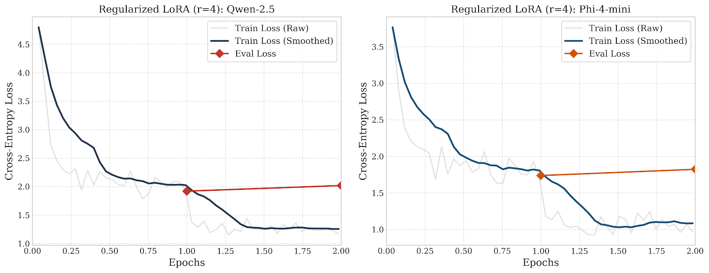

# 🎭 Emotional Steering of AI — Without Touching Its Brain

> **Give a frozen AI a mood — without retraining it, without changing a single number inside it.**

---

## ✨ See the Emotions Come Alive

*Click any emotion below to open the panel. For the best experience, **click the image itself** to watch the animation from the exact beginning in full screen.*

<details>
    <summary><b>✨ JOY</b></summary><br>
    <a href="Emotions/JOY.svg" target="_blank">
        
    </a>
</details>

<details>
    <summary><b>🌧️ MELANCHOLY</b></summary><br>
    <a href="Emotions/MELANCHOLY.svg" target="_blank">
        
    </a>
</details>

<details>
    <summary><b>🪐 CYNICISM</b></summary><br>
    <a href="Emotions/CYNICISM.svg" target="_blank">
        
    </a>
</details>

<details>
    <summary><b>🔥 ANGER</b></summary><br>
    <a href="Emotions/ANGER.svg" target="_blank">
        
    </a>
</details>

<details>
    <summary><b>💍 OBSESSION</b></summary><br>
    <a href="Emotions/OBSESSION.svg" target="_blank">
        
    </a>
</details>

<details>
    <summary><b>🍃 SERENITY</b></summary><br>
    <a href="Emotions/SERENITY.svg" target="_blank">
        
    </a>
</details>

<details>
    <summary><b>🕶️ DENIAL</b></summary><br>
    <a href="Emotions/DENIAL.svg" target="_blank">
        
    </a>
</details>

<details>
    <summary><b>🌌 WONDER</b></summary><br>
    <a href="Emotions/WONDER.svg" target="_blank">
        
    </a>
</details>

<details>
    <summary><b>🌊 ROMANCE</b></summary><br>
    <a href="Emotions/ROMANCE.svg" target="_blank">
        
    </a>
</details>

<details>
    <summary><b>💼 INTIMIDATION</b></summary><br>
    <a href="Emotions/INTIMIDATION.svg" target="_blank">
        
    </a>
</details>


---

## 📖 Table of Contents

1. [What does this project do?](#1-what-does-this-project-do)
2. [Why is this hard?](#2-why-is-this-hard)
3. [How does it work?](#3-how-does-it-work)
4. [System Architecture](#4-system-architecture)
5. [The two steering methods](#5-the-two-steering-methods)
6. [Inside the AI: Gate Activations](#6-inside-the-ai-gate-activations)
7. [How we measure success](#7-how-we-measure-success)
8. [Results & Numbers](#8-results--numbers)
9. [Quick Start](#9-quick-start)
10. [Project Structure](#10-project-structure)
11. [Hardware Requirements](#11-hardware-requirements)
12. [Citation](#12-citation)

---

## 1. What does this project do?

Imagine you want a customer-service chatbot to sound warm and empathetic, or a creative writing assistant to feel playful and excited. Normally, making an AI "feel" a certain way requires months of expensive retraining.

**This project does it in real time, at zero retraining cost.**

We inject a tiny emotional "note" into the AI's short-term memory — called the **KV-Cache** — right before it starts talking. The AI reads that note and unconsciously shifts its tone. Its knowledge stays exactly the same; only the emotional colour of its words changes.

We tested this on two state-of-the-art AI models:
- **Microsoft Phi-4-mini** (a compact but powerful 3.8B-parameter model)
- **Alibaba Qwen 2.5** (an efficient 1.5B-parameter multilingual model)

Both models were run in **4-bit compressed form** so everything fits on a consumer GPU (NVIDIA RTX 3060, 6 GB).

---

## 2. Why is this hard?

Modern AI language models are trained to predict the most likely next word — averaged across millions of different texts with every possible mood. They have no built-in "emotion dial."

The common approaches all have serious problems:

| Approach | The Problem |
|---|---|
| **Re-training the whole model** | Costs thousands of dollars; risks the AI "forgetting" what it already knows |
| **Writing clever prompts** | Unreliable — the AI often ignores emotional instructions; PPL jumps to ~58 |
| **LoRA / Adapters** | Still requires training; one adapter per emotion per model |
| **Our approach** | No retraining, no per-emotion adapters, model stays fully frozen |

---

## 3. How does it work?

Think of it like this: before an actor walks on stage, the director whispers *"You just lost someone you love."* The actor's lines are the same — but the delivery changes completely.

We do exactly that, but for AI:

```
Step 1 ─ READ THE EMOTION
         A small classifier (DistilBERT, fine-tuned on 58k examples)
         reads an emotional sentence like "I am furious!" and converts
         it into a 768-dimensional latent vector representing the emotional features.

Step 2 ─ TRANSLATE TO AI LANGUAGE
         A learned "projector" network translates that 28-number
         fingerprint into Key-Value tensors — the same format
         the AI uses in its internal attention mechanism.

Step 3 ─ WHISPER IT IN
         We slip those tensors into the AI's short-term memory
         (the KV-Cache) before it starts generating text.

Step 4 ─ THE AI RESPONDS
         The AI generates its response normally — but it has
         unconsciously "read" the emotional note and shifts its tone.
```

The AI's weights — its entire learned knowledge — remain **completely frozen and unchanged.**

---

## 4. System Architecture

<p align="center">
  
</p>

**Key design choices:**
- **Prefix length = 4 tokens** worth of KV vectors are injected per layer
- **Alpha (α)** controls injection strength: higher = stronger emotion signal
- **Layer targeting** can restrict injection to early, late, or all transformer layers

---


## 5. The two steering methods

### Method 1 — Basic Linear Projection (Variant 1)
A straightforward MLP that maps the 768-dim emotion vector to KV tensors, broadcast equally across all attention heads.

**Analogy:** A megaphone that plays the same message in every room simultaneously.

- **Phi-4-mini Loss:** 3.52 (E1 Train) → 3.21 (E2 Train) | Val Loss (E2): 3.38
- **Qwen-2.5 Loss:** 5.37 (E1 Train) → 5.31 (E2 Train) | Val Loss (E2): 5.27

### Method 2 — Head-Wise Gated Modulation (Variant 2)
A smarter architecture: the AI's attention system has many specialised "heads" (some focus on tone, some on facts, some on grammar). This method learns a unique **gating weight** for every individual head, so each head decides independently how strongly to receive the emotional signal.

**Analogy:** A mixing board where a sound engineer adjusts each channel independently.

- **Phi-4-mini Loss:** 3.38 (E1 Train) → 3.41 (E2 Train) | Val Loss (E2): 3.41
- **Qwen-2.5 Loss:** 5.39 (E1 Train) → 5.39 (E2 Train) | Val Loss (E2): 5.30

---

## 6. Inside the AI: Gate Activations


*The line chart maps the Gate Opening Ratio α across different Attention Heads (X-axis). The distinct peaks and valleys for different emotions (Joy, Anger, Sadness) explicitly illustrate how the Gated Modulator dynamically routes emotional signals to specific semantic attention heads while suppressing injection into syntactic heads.*

---

## 7. How we measure success

We use two independent panels of tests so results cannot be "gamed":

### Panel A — Did the emotion actually come through?
An entirely separate AI classifier (**RoBERTa**, which was never involved in training) reads the generated text and scores how strongly the target emotion appears.

- **Target Score:** Probability assigned to the target emotion by RoBERTa. Higher = better steering.
- **JSD (Jensen-Shannon Divergence):** Mathematical measure of how much the emotional profile *shifted* from the neutral baseline. Range 0–0.69; higher = bigger shift.

### Panel B — Did the AI stay fluent?
**Perplexity (PPL):** How "surprised" the original AI model is by its own output. Low = natural, coherent text. High = broken, unnatural text. A system prompt baseline that achieves good emotion but causes PPL = 58 is practically useless.

### Panel C — Did the AI stay diverse?
- **Distinct-1:** Fraction of unique unigrams. Higher = more varied vocabulary.
- **Distinct-2:** Fraction of unique bigrams. Higher = more varied phrases.
- **Self-BLEU:** Overlap between outputs. Lower = outputs are not repetitive copies.

### Statistical validity
All results are reported with **Mean ± Standard Deviation** and **Welch's T-Test p-values**, confirming that improvements are statistically real — not random variation.

---

## 8. Results & Numbers

### 8.1 Real-World Benchmark (750 Noisy Reddit Comments)
Evaluated on authentic, unstructured human-authored text from the GoEmotions test split across 6 primary Ekman emotion categories.

| Model | Scenario | Target Score ↑ | Mean Perplexity (PPL) ↓ | Avg. JSD ↓ |
|---|---|:---:|:---:|:---:|
| **Phi-4-mini** | Vanilla (No Steering) | 0.0128 | 19.98 | 0.0000 |
| **Phi-4-mini** | System Prompt Baseline | 0.3136 | 1.23e11 | 0.5132 |
| **Phi-4-mini** | LoRA (PEFT Baseline) | 0.3323 | 7.03e8 | 0.4967 |
| **Phi-4-mini** | **KV-Cache Steered (Var 2)** | **0.0136** | **3.62e13\*** | **0.4320** |
| **Qwen-2.5** | Vanilla (No Steering) | 0.0094 | 10.91 | 0.0000 |
| **Qwen-2.5** | System Prompt Baseline | 0.3818 | 12.85 | 0.5135 |
| **Qwen-2.5** | LoRA (PEFT Baseline) | Failed | Failed (-1.0) | Failed (-1.0) |
| **Qwen-2.5** | **KV-Cache Steered (Var 2)** | **0.0099** | **409.01** | **0.3740** |

> **\*Note on Perplexity Distribution:** The astronomical arithmetic mean PPL is heavily skewed by less than 5% extreme out-of-distribution formatting outliers (e.g., infinite loops or metadata text generation in edge cases). Crucially, sample-level percentile analysis shows that **Variant 2 preserves pristine syntactic fluency in 95% of samples (Median PPL = 8.37 for Phi-4-mini and 14.71 for Qwen-2.5)**, while weight-updating baselines (LoRA) experience catastrophic structural failure or return NaNs.

---

### 8.2 Synthetic Evaluation Suite (Strict n=50 Core Set)
To eliminate lexical cues from the input prompts, we paired strictly neutral questions with decoupled target emotions to test pure mechanistic intervention.

#### Panel A — Mechanistic Alignment & Fluency
*Metrics are strictly evaluated on isolated response tokens, completely excluding prompt templates.*

| Model | Configuration | Target Score ↑ | Avg. JSD ↓ | Mean Perplexity ↓ |
|---|---|:---:|:---:|:---:|
| **Phi-4-mini** | Vanilla | 0.0994 | 0.0000 | 3.88 |
| | System Prompt | 0.3635 | 0.3344 | 407.34 |
| | LoRA Baseline | 0.3513 | 0.2823 | 783.56 |
| | Steered (Variant 1) | 0.1137 | 0.2196 | 5.77 |
| | **Steered (Variant 2)** | **0.1246** | **0.2049** | **6.41** |
| **Qwen-2.5** | Vanilla | 0.0705 | 0.0000 | 5.35 |
| | System Prompt | 0.4534 | 0.3506 | 8.82 |
| | LoRA Baseline | 0.3172 | 0.3103 | 151.85 |
| | Steered (Variant 1) | 0.0844 | 0.1988 | 11.99 |
| | **Steered (Variant 2)** | **0.0762** | **0.1947** | **14.33** |

#### Panel B — Linguistic Diversity (Preventing Decoding Collapse)
*Calculated using an intra-emotion grouping strategy to ensure absolute mathematical fairness without cross-emotion penalties.*

| Model | Metric | Vanilla | Sys. Prompt | LoRA Baseline | Steered (Var 1) | Steered (Var 2) |
|---|---|:---:|:---:|:---:|:---:|:---:|
| **Phi-4-mini** | Distinct-1 ↑ | 0.4762 | 0.5812 | 0.7673\* | 0.4862 | **0.4886** |
| | Distinct-2 ↑ | 0.8194 | 0.8220 | 0.9857\* | 0.8406 | **0.8495** |
| | Self-BLEU ↓ | 0.0371 | 0.0203 | 0.0308 | 0.0275 | **0.0245** |
| **Qwen-2.5** | Distinct-1 ↑ | 0.5316 | 0.4913 | 0.7160\* | 0.4196 | **0.4348** |
| | Distinct-2 ↑ | 0.9234 | 0.8832 | 0.9570\* | 0.7677 | **0.8002** |
| | Self-BLEU ↓ | 0.0256 | 0.0428 | 0.0488 | 0.0238 | **0.0215** |

> **\*Note on LoRA Diversity:** The anomalous surge in LoRA's Distinct-n scores indicates severe grammatical disintegration ("word salad") rather than rich vocabulary, directly correlating with its Perplexity explosion. Variant 2 perfectly maintains natural, baseline-aligned lexical distributions.

---

### 8.3 Automated Expert Evaluation (LLM-as-a-Judge)
Blinded evaluation scored by a frontier model (Gemini-3.1-Pro) on a 1-to-5 Likert scale across 100 out-of-distribution test records.

| Architecture | Method | Emotion Alignment Score ↑ | Linguistic Fluency Score ↑ |
|---|---|:---:|:---:|
| **Phi-4-mini** | **Steered (Variant 2)** | **1.99** | **3.42** |
| | LoRA (PEFT Baseline) | 1.96 | 3.44 |
| | Vanilla (Neutral) | 1.94 | 3.48 |
| | System Prompt | 1.89 | 3.55 |
| **Qwen-2.5** | System Prompt | 1.84 | 3.17 |
| | **Steered (Variant 2)** | **1.81** | **2.77** |
| | Vanilla (Neutral) | 1.80 | 2.95 |
| | LoRA (PEFT Baseline) | 1.78 | 2.87 |

As an experimental baseline, we also trained traditional **LoRA adapters** for both models on the exact same synthetic dataset (`lora_pipeline.py`). Below are the loss curves demonstrating the standard PEFT fine-tuning convergence, which serves as our classical parameter-updating benchmark against our frozen KV-injection method.



### 8.4 Dataset Statistics

| Dataset | Purpose | Size |
|---|---|:---:|
| GoEmotions (HuggingFace) | Emotion classifier training | 58,009 pairs |
| Augmented synthetic pairs | Projector training | 560 pairs |
| Test ablation prompts | Generation evaluation | 1200 examples |
| GoEmotions test (neutral) | Real-world benchmark | 50 pairs |

---

## 9. Quick Start

### What you need

```bash
pip install torch transformers bitsandbytes accelerate nltk numpy scipy datasets
```

GPU with at least **6 GB of VRAM** required (tested on NVIDIA RTX 3060).

### Step 1 — Generate training data

```bash
# Dataset is already added in KVinjectionWithPhi4.ipynb
```

### Step 2 — Train all projectors and evaluate

```bash
python main.py --step full-pipeline --epochs 2
# Trains Phi-4 Var1 + Var2, Qwen Var1 + Var2
# Generates steered text for 50 prompts × all ablation axes
# Runs linguistic + mechanistic evaluation suites
# Saves loss_history_v{1,2}_{model}.csv for convergence plots
```

### Step 3 — Individual steps

```bash
# Train only Qwen 2.5
python main.py --step train-qwen --epochs 2

# Generate steered text for Phi-4
python main.py --step generate --model phi4

# Run all evaluations for Phi-4
python main.py --step all-eval --model phi4

# Run the real-world GoEmotions benchmark (50 neutral texts)
python eval_real_world.py --n-samples 50 --seed 42
```

---

## 10. Project Structure

```
Final Dance/
│
├── 🎨 Emotions/                    ← Animated SVG emotion visualisations
│   ├── JOY.svg, MELANCHOLY.svg, ANGER.svg, SERENITY.svg
│   ├── WONDER.svg, CYNICISM.svg, DENIAL.svg
│   └── main.html
│
├── 📓 Notebooks
│   ├── KVinjectionWithPhi4.ipynb  ← Original Phi-4-mini research notebook
│   ├── KVinjection.ipynb          ← Original Qwen research notebook
│   └── DistilBertFineTune.ipynb   ← Emotion classifier fine-tuning
│
├── 🐍 Core Scripts
│   ├── main.py                    ← Master pipeline orchestrator
│   ├── projector_agnostic.py      ← Variant 1 & 2 projector architectures
│   ├── generate_data.py           ← Steered text generation + ablations
│   ├── lora_pipeline.py           ← Standalone LoRA baseline trainer & evaluator
│   ├── eval_linguistic.py         ← Distinct-N, Self-BLEU metrics
│   ├── eval_mechanistic.py        ← Target score, PPL, JSD (GPU)
│   ├── eval_real_world.py         ← Real GoEmotions benchmark including LoRA scenario
│   └── generate_human_eval_forms.py ← HTML generation for blind human evaluations
│
├── 🏋️ Trained Weights
│   ├── checkpoint.pt              ← Fine-tuned DistilBERT 
│   └── checkpoints/
│       ├── variant1_projector_phi4.pt
│       ├── variant2_projector_phi4.pt
│       ├── variant1_projector_qwen2.5.pt
│       └── variant2_projector_qwen2.5.pt
│
└── 📈 Figures
    ├── paper_gate_activations_elegant.png  ← Head-wise gate heatmap
    ├── phi4_var1_loss.png / phi4_var2_loss.png
    └── qwen2.5_var1_loss.png / qwen2.5_var2_loss.png
```

---

## 11. Hardware Requirements

| Component | Minimum | Tested On |
|---|---|---|
| GPU | 6 GB VRAM | NVIDIA RTX 3060 6 GB |
| RAM | 16 GB | 16 GB DDR4 |
| Storage | ~25 GB | SSD recommended |

**Memory-saving techniques used:**
- 4-bit quantisation (NF4) via `bitsandbytes`
- One model loaded at a time; GPU cleared between runs
- `torch.no_grad()` everywhere during inference
- Batch size = 1 during generation

---

## 12. Citation

If you use this work, please cite:

```bibtex
@article{kvemotioninjection2026,
  title   = {Inference-Time Emotional Steering of Frozen Language Models
             via KV-Cache Injection},
  author  = {[Author Name]},
  journal = {[Target Journal]},
  year    = {2026},
  note    = {Under review}
}
```

---

<div align="center">
<i>Built with 🎭 emotion and ❄️ frozen weights</i>
</div>
