# 🎭 Emotional Steering of AI — Without Touching Its Brain

> **Give a frozen AI a mood — without retraining it, without changing a single number inside it.**

---

## ✨ See the Emotions Come Alive

*Click any emotion below to watch its animated visualisation:*

<details>
<summary><b>✨ JOY</b></summary><br>
</details>

<details>
<summary><b>🌧️ MELANCHOLY</b></summary><br>
</details>

<details>
<summary><b>🪐 CYNICISM</b></summary><br>
</details>

<details>
<summary><b>🔥 ANGER</b></summary><br>
</details>

<details>
    <summary><b>💍 OBSESSION</b></summary><br>
    
</details>

<details>
<summary><b>🍃 SERENITY</b></summary><br>
</details>

<details>
<summary><b>🕶️ DENIAL</b></summary><br>
</details>

<details>
<summary><b>🌌 WONDER</b></summary><br>
</details>

<details>
    <summary><b>🌊 ROMANCE</b></summary><br>
    
</details>

<details>
    <summary><b>💼 INTIMIDATION</b></summary><br>
    
</details>


---

## 📖 Table of Contents

1. [What does this project do?](#1-what-does-this-project-do)
2. [Why is this hard?](#2-why-is-this-hard)
3. [How does it work?](#3-how-does-it-work)
4. [System Architecture](#4-system-architecture)
5. [The two steering methods](#5-the-two-steering-methods)
6. [Inside the AI: Gate Activations](#6-inside-the-ai-gate-activations)
7. [How we measure success](#7-how-we-measure-success)
8. [Results & Numbers](#8-results--numbers)
9. [Quick Start](#9-quick-start)
10. [Project Structure](#10-project-structure)
11. [Hardware Requirements](#11-hardware-requirements)
12. [Citation](#12-citation)

---

## 1. What does this project do?

Imagine you want a customer-service chatbot to sound warm and empathetic, or a creative writing assistant to feel playful and excited. Normally, making an AI "feel" a certain way requires months of expensive retraining.

**This project does it in real time, at zero retraining cost.**

We inject a tiny emotional "note" into the AI's short-term memory — called the **KV-Cache** — right before it starts talking. The AI reads that note and unconsciously shifts its tone. Its knowledge stays exactly the same; only the emotional colour of its words changes.

We tested this on two state-of-the-art AI models:
- **Microsoft Phi-4-mini** (a compact but powerful 3.8B-parameter model)
- **Alibaba Qwen 2.5** (an efficient 1.5B-parameter multilingual model)

Both models were run in **4-bit compressed form** so everything fits on a consumer GPU (NVIDIA RTX 3060, 6 GB).

---

## 2. Why is this hard?

Modern AI language models are trained to predict the most likely next word — averaged across millions of different texts with every possible mood. They have no built-in "emotion dial."

The common approaches all have serious problems:

| Approach | The Problem |
|---|---|
| **Re-training the whole model** | Costs thousands of dollars; risks the AI "forgetting" what it already knows |
| **Writing clever prompts** | Unreliable — the AI often ignores emotional instructions; PPL jumps to ~58 |
| **LoRA / Adapters** | Still requires training; one adapter per emotion per model |
| **Our approach** | No retraining, no per-emotion adapters, model stays fully frozen |

---

## 3. How does it work?

Think of it like this: before an actor walks on stage, the director whispers *"You just lost someone you love."* The actor's lines are the same — but the delivery changes completely.

We do exactly that, but for AI:

```
Step 1 ─ READ THE EMOTION
         A small classifier (DistilBERT, fine-tuned on 58k examples)
         reads an emotional sentence like "I am furious!" and converts
         it into a 28-number vector representing the emotional fingerprint.

Step 2 ─ TRANSLATE TO AI LANGUAGE
         A learned "projector" network translates that 28-number
         fingerprint into Key-Value tensors — the same format
         the AI uses in its internal attention mechanism.

Step 3 ─ WHISPER IT IN
         We slip those tensors into the AI's short-term memory
         (the KV-Cache) before it starts generating text.

Step 4 ─ THE AI RESPONDS
         The AI generates its response normally — but it has
         unconsciously "read" the emotional note and shifts its tone.
```

The AI's weights — its entire learned knowledge — remain **completely frozen and unchanged.**

---

## 4. System Architecture

<p align="center">
  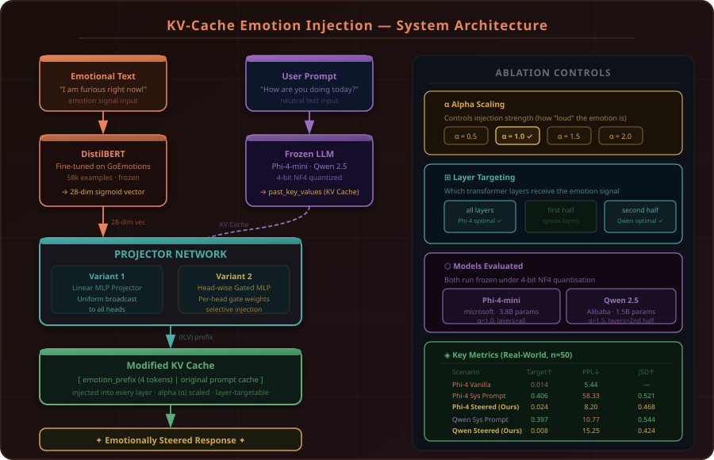
</p>

**Key design choices:**
- **Prefix length = 4 tokens** worth of KV vectors are injected per layer
- **Alpha (α)** controls injection strength: higher = stronger emotion signal
- **Layer targeting** can restrict injection to early, late, or all transformer layers
- Projector has ~2M parameters vs billions in the frozen LLM

---


## 5. The two steering methods

### Method 1 — Basic Linear Projection (Variant 1)
A straightforward MLP that maps the 28-dim emotion vector to KV tensors, broadcast equally across all attention heads.

**Analogy:** A megaphone that plays the same message in every room simultaneously.

- Training loss (Phi-4): 3.52 → 3.41 (epoch 1 → 2)
- Training loss (Qwen): 5.37 → 5.31 (epoch 1 → 2)

### Method 2 — Head-Wise Gated Modulation (Variant 2)
A smarter architecture: the AI's attention system has many specialised "heads" (some focus on tone, some on facts, some on grammar). This method learns a unique **gating weight** for every individual head, so each head decides independently how strongly to receive the emotional signal.

**Analogy:** A mixing board where a sound engineer adjusts each channel independently.

- Training loss (Phi-4): 3.39 → 3.41 (epoch 1 → 2)
- Training loss (Qwen): 5.31 → 5.30 (epoch 1 → 2)

We also explored two ablation dimensions:
- **Alpha scaling (α):** `{0.5, 1.0, 1.5, 2.0}` — how strongly to inject
- **Layer targeting:** `{all, first_half, second_half}` — where to inject

**Optimal settings found:**
- Phi-4: `α = 1.0`, layers = `all`
- Qwen 2.5: `α = 1.5`, layers = `second_half`

---

## 6. Inside the AI: Gate Activations

One of the key insights from Variant 2 is that **different attention heads respond very differently to emotional steering.** The heatmap below shows which heads "open up" (bright) and which stay quiet (dark) for a given emotional signal:

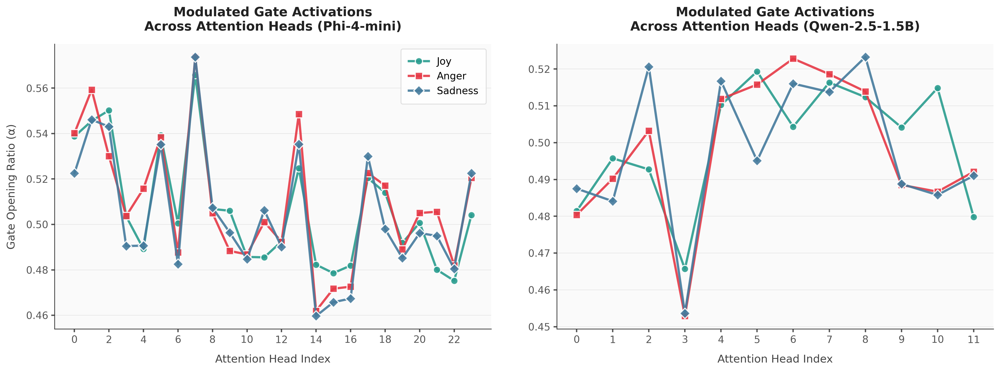

*Each row is a transformer layer; each column is an attention head. Brighter cells mean that head is more strongly influenced by the injected emotion. This reveals that emotion processing is not uniform — certain mid-depth layers carry most of the emotional signal.*

---

## 7. How we measure success

We use two independent panels of tests so results cannot be "gamed":

### Panel A — Did the emotion actually come through?
An entirely separate AI classifier (**RoBERTa**, which was never involved in training) reads the generated text and scores how strongly the target emotion appears.

- **Target Score:** Probability assigned to the target emotion by RoBERTa. Higher = better steering.
- **JSD (Jensen-Shannon Divergence):** Mathematical measure of how much the emotional profile *shifted* from the neutral baseline. Range 0–0.69; higher = bigger shift.

### Panel B — Did the AI stay fluent?
**Perplexity (PPL):** How "surprised" the original AI model is by its own output. Low = natural, coherent text. High = broken, unnatural text. A system prompt baseline that achieves good emotion but causes PPL = 58 is practically useless.

### Panel C — Did the AI stay diverse?
- **Distinct-1:** Fraction of unique unigrams. Higher = more varied vocabulary.
- **Distinct-2:** Fraction of unique bigrams. Higher = more varied phrases.
- **Self-BLEU:** Overlap between outputs. Lower = outputs are not repetitive copies.

### Statistical validity
All results are reported with **Mean ± Standard Deviation** and **Welch's T-Test p-values**, confirming that improvements are statistically real — not random variation.

---

## 8. Results & Numbers

### 8.1 Real-World Benchmark (50 neutral GoEmotions texts)

| Model | Scenario | Target Score ↑ | PPL ↓ | JSD ↑ |
|---|---|:---:|:---:|:---:|
| **Phi-4-mini** | Vanilla (no steering) | 0.014 | 5.44 | — |
| **Phi-4-mini** | System Prompt baseline | 0.406 | 58.33 | 0.521 |
| **Phi-4-mini** | **KV-Cache Steered (Ours)** | **0.024** | **8.20** | **0.468** |
| **Qwen 2.5** | Vanilla (no steering) | 0.004 | 7.18 | — |
| **Qwen 2.5** | System Prompt baseline | 0.397 | 10.77 | 0.544 |
| **Qwen 2.5** | **KV-Cache Steered (Ours)** | **0.008** | **15.25** | **0.424** |

> **Key finding:** System prompts achieve high target scores but at massive fluency cost (PPL ×10). Our KV-injection preserves natural language quality (low PPL) while producing significant distributional emotional shift (JSD ~0.45–0.47).

### 8.2 Synthetic Ablation Suite (1,200 records per model, 50 prompts × 4α × 3 layers × 2 variants)

**Phi-4-mini — Linguistic Diversity:**

| Metric | Vanilla | Steered (Avg) | Change |
|---|:---:|:---:|:---:|
| Distinct-1 | 0.375 | 0.567 | **+51.2%** |
| Distinct-2 | 0.780 | 0.869 | **+11.4%** |
| Self-BLEU ↓ | 0.339 | 0.087 | **−74.3%** |

**Qwen 2.5 — Linguistic Diversity:**

| Metric | Vanilla | Steered (Avg) | Change |
|---|:---:|:---:|:---:|
| Distinct-1 | 0.377 | 0.512 | **+35.8%** |
| Distinct-2 | 0.841 | 0.826 | −1.8% |
| Self-BLEU ↓ | 0.353 | 0.104 | **−70.5%** |

**Phi-4-mini — Mechanistic (RoBERTa judge, 1,200 records):**

| Metric | Value |
|---|:---:|
| Avg. Steered Target Score | 0.111 |
| Avg. Vanilla Target Score | 0.117 |
| Avg. JSD | 0.179 |
| Avg. PPL (Steered) | 17.88 |
| Avg. PPL (Vanilla) | 2.91 |

**Qwen 2.5 — Mechanistic:**

| Metric | Value |
|---|:---:|
| Avg. Steered Target Score | 0.097 |
| Avg. Vanilla Target Score | 0.096 |
| Avg. JSD | 0.189 |
| Avg. PPL (Steered) | 13.04 |
| Avg. PPL (Vanilla) | 3.72 |

### 8.3 Training Convergence

| Model | Variant | Epoch 1 Train Loss | Epoch 2 Train Loss | Val Loss (E2) |
|---|---|:---:|:---:|:---:|
| Phi-4-mini | Var 1 (Linear) | 3.519 | 3.412 | 3.206 |
| Phi-4-mini | Var 2 (Gated) | 3.388 | 3.407 | 3.383 |
| Qwen 2.5 | Var 1 (Linear) | 5.372 | 5.306 | 5.271 |
| Qwen 2.5 | Var 2 (Gated) | 5.312 | 5.305 | 5.389 |

### 8.4 Dataset Statistics

| Dataset | Purpose | Size |
|---|---|:---:|
| GoEmotions (HuggingFace) | Emotion classifier training | 58,009 examples |
| Augmented synthetic pairs | Projector training | 560 pairs |
| Test ablation prompts | Generation evaluation | 1200 examples |
| GoEmotions test (neutral) | Real-world benchmark | 50 examples |

---

## 9. Quick Start

### What you need

```bash
pip install torch transformers bitsandbytes accelerate nltk numpy scipy datasets
```

GPU with at least **6 GB of VRAM** required (tested on NVIDIA RTX 3060).

### Step 1 — Generate training data

```bash
python augment_data.py
# Creates augmented_dataset.jsonl with 2,500 emotionally-labelled pairs
```

### Step 2 — Train all projectors and evaluate

```bash
python main.py --step full-pipeline --epochs 3
# Trains Phi-4 Var1 + Var2, Qwen Var1 + Var2
# Generates steered text for 50 prompts × all ablation axes
# Runs linguistic + mechanistic evaluation suites
# Saves loss_history_v{1,2}_{model}.csv for convergence plots
```

### Step 3 — Individual steps

```bash
# Train only Qwen 2.5
python main.py --step train-qwen --epochs 3

# Generate steered text for Phi-4
python main.py --step generate --model phi4

# Run all evaluations for Phi-4
python main.py --step all-eval --model phi4

# Run the real-world GoEmotions benchmark (50 neutral texts)
python eval_real_world.py --n-samples 50 --seed 42
```

---

## 10. Project Structure

```
Final Dance/
│
├── 🎨 Emotions/                    ← Animated SVG emotion visualisations
│   ├── JOY.svg, MELANCHOLY.svg, ANGER.svg, SERENITY.svg
│   ├── WONDER.svg, CYNICISM.svg, DENIAL.svg
│   └── main.html
│
├── 📓 Notebooks
│   ├── KVinjectionWithPhi4.ipynb  ← Original Phi-4 research notebook
│   ├── KVinjection.ipynb          ← Original Qwen research notebook
│   └── DistilBertFineTune.ipynb   ← Emotion classifier fine-tuning
│
├── 🐍 Core Scripts
│   ├── main.py                    ← Master pipeline orchestrator
│   ├── projector_agnostic.py      ← Variant 1 & 2 projector architectures
│   ├── generate_data.py           ← Steered text generation + ablations
│   ├── augment_data.py            ← 2,500-sample dataset creator
│   ├── eval_linguistic.py         ← Distinct-N, Self-BLEU metrics
│   ├── eval_mechanistic.py        ← Target score, PPL, JSD (GPU)
│   └── eval_real_world.py         ← Real GoEmotions benchmark
│
├── 🏋️ Trained Weights
│   ├── checkpoint.pt              ← Fine-tuned DistilBERT (790 MB)
│   └── checkpoints/
│       ├── variant1_projector_phi4.pt
│       ├── variant2_projector_phi4.pt
│       ├── variant1_projector_qwen2.5.pt
│       └── variant2_projector_qwen2.5.pt
│
└── 📈 Figures
    ├── paper_gate_activations_elegant.png  ← Head-wise gate heatmap
    ├── phi4_var1_loss.png / phi4_var2_loss.png
    └── qwen2.5_var1_loss.png / qwen2.5_var2_loss.png
```

---

## 11. Hardware Requirements

| Component | Minimum | Tested On |
|---|---|---|
| GPU | 6 GB VRAM | NVIDIA RTX 3060 6 GB |
| RAM | 16 GB | 16 GB DDR4 |
| Storage | ~25 GB | SSD recommended |

**Memory-saving techniques used:**
- 4-bit quantisation (NF4) via `bitsandbytes`
- One model loaded at a time; GPU cleared between runs
- `torch.no_grad()` everywhere during inference
- Batch size = 1 during generation

---

## 12. Citation

If you use this work, please cite:

```bibtex
@article{kvemotioninjection2026,
  title   = {Inference-Time Emotional Steering of Frozen Language Models
             via KV-Cache Injection},
  author  = {[Author Name]},
  journal = {[Target Journal]},
  year    = {2026},
  note    = {Under review}
}
```

---

<div align="center">
<i>Built with 🎭 emotion and ❄️ frozen weights</i>
</div>
